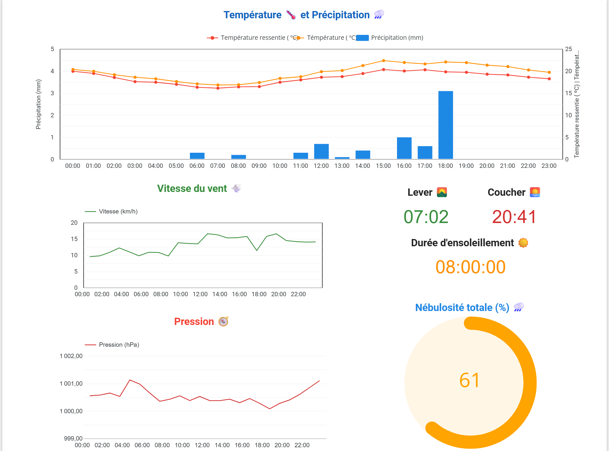

# Pipeline ETL Météo Paris


Flux Open‑Meteo vers Kafka, traitement avec Spark Structured Streaming, chargement dans BigQuery et visualisation via Looker Studio. Orchestration par Airflow.

Vous pouvez changer la ville selon la latitude et la longitude dans l’API. Le ville actuel est Paris.
## Architecture


## Topics Kafka
* __Horaire__: `weather_paris`
* __Quotidien__: `daily_paris`

Produits par `dags/kafka_stream.py` (appel API Open‑Meteo, normalisation et envoi vers Kafka).

## Consommateur Spark Streaming
* __Entrée__: `spark_stream.py`
* __Déclenché par__: `dags/spark_stream_dag.py` (planificatgion: `@daily`)
* __Bootstrap Kafka__:
  * Dans les conteneurs: `broker:29092`
  * Depuis l’hôte: `localhost:9092`

## BigQuery
* __Project ID__: `VOTRE_PROJECT_ID` (modifiable dans `spark_stream.py`)
* __Dataset__: `VOTRE_NOM_DATASET` (modifiable dans `spark_stream.py`)
* __Tables__:
  * Horaire: `meteo_hourly`
  * Quotidien: `meteo_daily`

Schémas selon `spark_stream.py`:
* __meteo_hourly__: `id`(STRING, REQUIRED), `time_text`(STRING), `time_ts`(TIMESTAMP), `latitude`(FLOAT64), `longitude`(FLOAT64), `timezone`(STRING), `timezone_abbreviation`(STRING), `temperature_2m`(FLOAT64), `relative_humidity_2m`(FLOAT64), `apparent_temperature`(FLOAT64), `precipitation`(FLOAT64), `surface_pressure`(FLOAT64), `cloud_cover`(FLOAT64), `wind_speed_10m`(FLOAT64)
* __meteo_daily__: `id`(STRING, REQUIRED), `date_text`(STRING), `date_ts`(DATE), `latitude`(FLOAT64), `longitude`(FLOAT64), `timezone`(STRING), `timezone_abbreviation`(STRING), `sunrise_time`(STRING), `sunset_time`(STRING), `sunshine_duration`(FLOAT64), `sunshine_duration_time`(STRING)


## Démarrage rapide
1) Préparer les credentials BigQuery (placer `config/config.json`).
2) Lancer les services:
```bash
docker compose up -d
```
3) Ouvrir Airflow UI: http://localhost:8080
   * Déclencher le DAG producteur: `weather_daily` (planification `@daily`)
   * Déclencher le DAG consommateur: `spark_stream_dag` (planification `@daily`)

4) Option dev en local (hors Airflow) depuis l’hôte:
```bash
python3 spark_stream.py
```

## Outils & URLs
* __Kafka Control Center__: http://localhost:9021
* __Spark Master UI__: http://localhost:9090
* __Airflow Web UI__: http://localhost:8080
* __BigQuery__: https://console.cloud.google.com/bigquery 

## Organisation du code
* __DAGs__: `dags/`
* __Job Spark Streaming__: `spark_stream.py`
* __Entrypoint Airflow__: `script/entrypoint.sh`
* __Dépendances Python__: `requirements.txt`

## Visualisation par Looker Studio
Le rapport se met automatiquement à jour chaque jour. 



J’ai filtré les données à la date d’aujourd’hui.

 

## Commentaire
C’est un pipeline ETL de type streaming, mais j’ai choisi de le mettre en batch en raison des caractéristiques des données. En effet, l’API Open-Meteo envoie des données une fois par jour. Ainsi, il n’est pas nécessaire d’utiliser Kafka, mais je souhaite l’employer dans un but d’apprentissage et bien comprendre le fonctionnement.