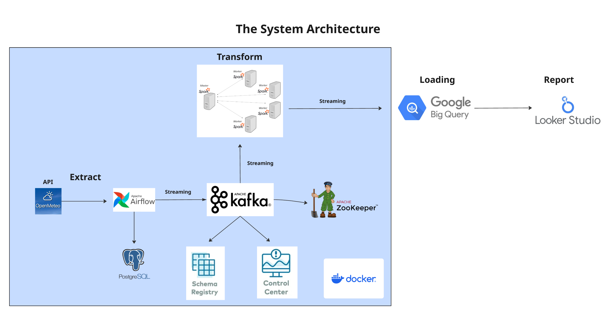

# Pipeline ETL Météo Paris

Flux Open‑Meteo vers Kafka, traitement avec Spark Structured Streaming, chargement dans BigQuery et visualisation via Looker Studio/BigQuery. Orchestration par Airflow.

Vous pouvez changer la ville selon la latitude et la longitude dans l’API

## Architecture


## Topics Kafka
* __Horaire__: `weather_paris`
* __Quotidien__: `daily_paris`

Produits par `dags/kafka_stream.py` (appel API Open‑Meteo, normalisation et envoi vers Kafka).
## Consommateur Spark Streaming
* __Entrée__: `spark_stream.py`
* __Déclenché par__: `dags/spark_stream_dag.py` (planification: `@daily`)
* __Bootstrap Kafka__:
  * Dans les conteneurs: `broker:29092`
  * Depuis l’hôte: `localhost:9092`

## BigQuery
* __Project ID__: `VOTRE_PROJECT_ID` (modifiable dans `spark_stream.py`)
* __Dataset__: `meteo_pazi` 
* __Tables__:
  * Horaire: `meteo_hourly`
  * Quotidien: `meteo_daily`

Schémas selon `spark_stream.py`:
* __meteo_hourly__: `id`(STRING, REQUIRED), `time_text`(STRING), `time_ts`(TIMESTAMP), `latitude`(FLOAT64), `longitude`(FLOAT64), `timezone`(STRING), `timezone_abbreviation`(STRING), `temperature_2m`(FLOAT64), `relative_humidity_2m`(FLOAT64), `apparent_temperature`(FLOAT64), `precipitation`(FLOAT64), `surface_pressure`(FLOAT64), `cloud_cover`(FLOAT64), `wind_speed_10m`(FLOAT64)
* __meteo_daily__: `id`(STRING, REQUIRED), `date_text`(STRING), `date_ts`(DATE), `latitude`(FLOAT64), `longitude`(FLOAT64), `timezone`(STRING), `timezone_abbreviation`(STRING), `sunrise_time`(STRING), `sunset_time`(STRING), `sunshine_duration`(FLOAT64), `sunshine_duration_time`(STRING)


## Démarrage rapide
1) Préparer les credentials BigQuery (placer `config/config.json`).
2) Lancer les services:
```bash
docker compose up -d
```
3) Ouvrir Airflow UI: http://localhost:8080
   * Déclencher le DAG producteur: `weather_daily` (planification `@daily`)
   * Déclencher le DAG consommateur: `spark_stream_dag` (planification `@daily`)

4) Option dev en local (hors Airflow) depuis l’hôte:
```bash
python3 spark_stream.py
```

## Outils & URLs
* __Kafka Control Center__: http://localhost:9021
* __Spark Master UI__: http://localhost:9090
* __Airflow Web UI__: http://localhost:8080
* __BigQuery__: https://console.cloud.google.com/bigquery 

## Organisation du code
* __DAGs__: `dags/`
* __Job Spark Streaming__: `spark_stream.py`
* __Entrypoint Airflow__: `script/entrypoint.sh`
* __Dépendances Python__: `requirements.txt`

## Visualisation par Looker Studio